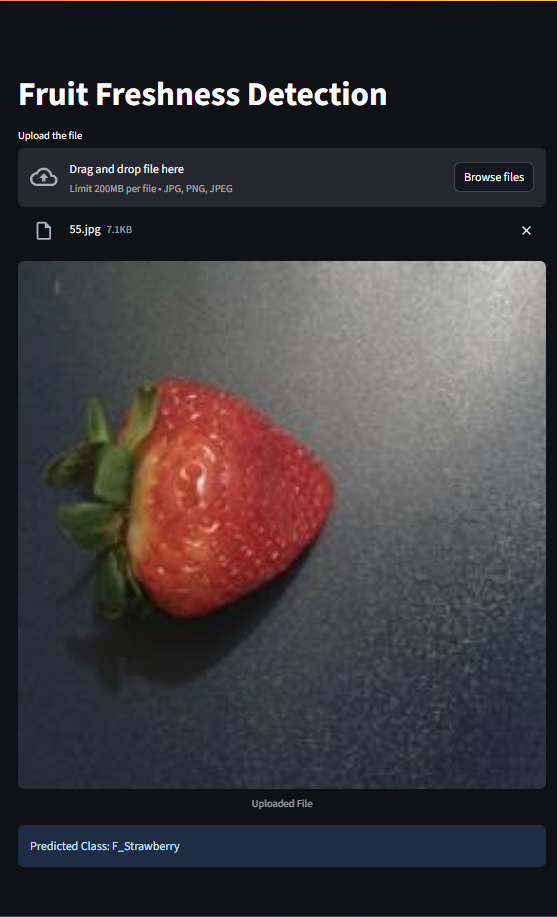
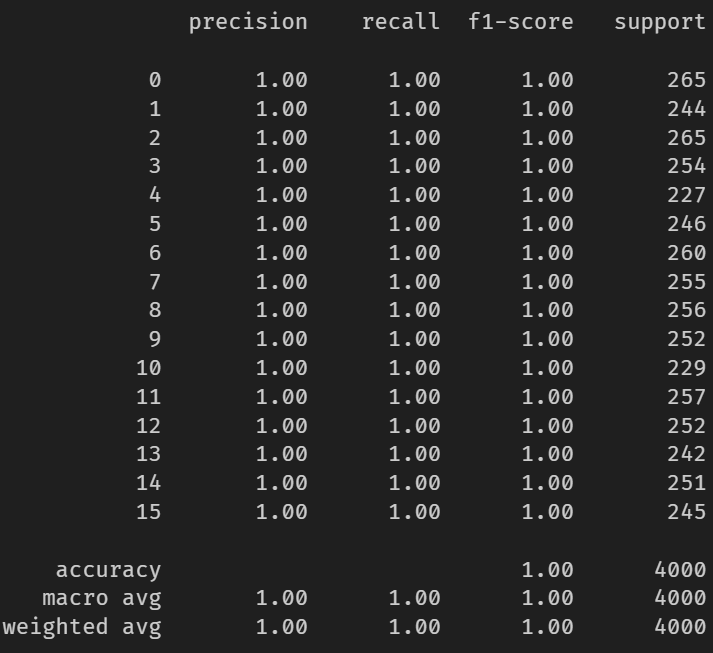
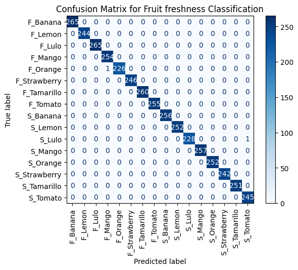

# 🍓 Fruit Freshness Detection

**Imagine a scenario:**

- A fruit supplier company need to supply fresh food to supermarkets and local farmers' markets, striving to deliver high-quality goods to their customers. They are facing  several operational issues due to  inconsistent manual quality inspections.So they plans to leverage AI to address this problem by automating the freshness 
inspection process.  
They supply 8 kinds of fruits/vegetables: 
    - Banana 
    - Lemon  
    - Lulo  
    - Mango  
    - Orange  
    - Strawberry  
    - Tamarillo  
    - Tomato 



## 🧠 Model Overview
The freshness detection model is built using a **transfer learning approach** with a **ResNet50** architecture, pretrained on ImageNet. Here's a summary of the key model design choices:

- 🔍 **Feature Extractor**: Most layers of ResNet50 are frozen to leverage pre-trained visual feature representations.
- 🔼 **Fine-Tuning**: The final block (`layer4`) is unfrozen for training to adapt to the domain of fruit freshness detection.
- 🎯 **Classification Head**:
  - Global Average Pooling (inherent in ResNet50)
  - Dropout layer (to reduce overfitting)
  - Final fully connected layer outputting 16 classes — one for each fruit/freshness category, e.g. `F_Banana`, `S_Lemon`, etc.

The model takes in 224×224 RGB images, applies standard normalization, and outputs a predicted class label corresponding to the fruit type and its freshness (`F_` = Fresh, `S_` = Spoiled).

---

## 📊 Evaluation Metrics
- Overall Accuracy 99.95%
- Classification report
- 
- Confusion Matrix
- 
- ### Interpretation of High Accuracy & Overfitting Concern
    - Best-performing model is the ResNet50-based classifier, trained on a 75%/25% train/test split. During training, the held-out 25% test set was used as a validation set each epoch. Also leveraged Optuna to identify optimal hyper-parameters (learning rate, dropout rate). Despite the near-perfect 99.95% accuracy and perfect per-class scores, several factors confirm genuine generalization rather than overfitting -
        - **Consistent train/val trends:** Both training and validation loss decreased smoothly across 5 epochs, with validation accuracy rising in lockstep—no large divergence or sudden spikes.
        - **Optuna-driven robustness:** Automated hyperparameter search reduced manual bias and ensured the model’s performance was stable across different configurations.
        - **Regularization & augmentation:** Dropout, batch normalization, and extensive data augmentations were applied to mitigate the risk of memorization.

## Set-up

1. To get started, first install the required libraries:
    ```commandline
     pip install -r streamlit-app/requirements.txt
    ```
   
3. Run the streamlit app:
   ```commandline
   streamlit run streamlit-app/main.py
   ```
   

© Amanat. All rights reserved.

**Additional Terms:**
This software is licensed under the MIT License. However, commercial use of this software is strictly prohibited without prior written permission from the author. Attribution must be given in all copies or substantial portions of the software.
